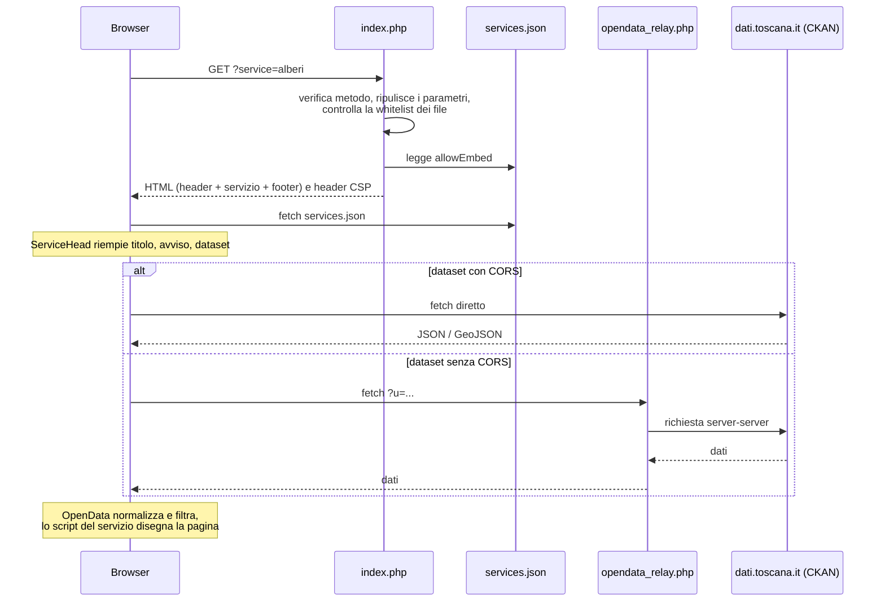

# Architettura
{: .no_toc }

<details open markdown="block">
  <summary>Indice</summary>
  {: .text-delta }
1. TOC
{:toc}
</details>

---

## In breve

Comune in Chiaro è diviso in due metà:

- **lato server (PHP)**: un unico file, `index.php`, decide quale pagina comporre, ne verifica la validità e invia gli header di sicurezza. Non legge né elabora i dati aperti;
- **lato browser (JavaScript)**: legge `services.json`, scarica i dataset dal portale open data, li filtra e li mostra.

Non c'è database. Il server non conserva nulla: tutte le informazioni stanno in `config.php`, `services.json` e nei dataset remoti.



## Parametri dell'indirizzo

Tutte le pagine passano da `index.php` e si distinguono per i parametri:

| Parametro | Valori | Effetto |
| :--- | :--- | :--- |
| `main` | nome di un file in `views/main/` | Pagina generale: `home` (predefinita), `about`. |
| `service` | nome di un file in `views/services/services/` | Pagina di un servizio. |
| `sheet` | nome di un file in `views/services/sheets/` | Scheda di un oggetto. Richiede `obj_id`. |
| `obj_id` | codice dell'oggetto | Oggetto mostrato nella scheda. Richiede `sheet`. |
| `breadCrumb` | `true` | Mostra il percorso di navigazione. |
| `map` | `true` | Carica Leaflet e Turf. |
| `scan` | `true` | Carica html5-qrcode. |
| `embed` | `true` | Modalità incorporata (vedi [Incorporare un servizio](embed)). |
| altri | qualsiasi | Ignorati dal PHP, ma leggibili dai filtri `source: "query"` dei dataset. |

`main`, `service`, `sheet` e `obj_id` vengono **ripuliti**: convertiti in minuscolo e privati di tutto ciò che non è `a-z`, `0-9`, `-`, `_`. I parametri vero/falso accettano `true`, `1`, `on`, `yes`.

## Come il router sceglie la pagina

1. Metodo diverso da `GET` o `HEAD` → **405**.
2. Nessun parametro `main`, `service` o `sheet` → `main=home`.
3. Si costruiscono le whitelist leggendo i file presenti nelle cartelle `views/main/`, `views/services/services/`, `views/services/sheets/`. Un valore che non corrisponde a un file viene scartato e registrato nel log.
4. `obj_id` senza `sheet` valido, o `sheet` valido senza `obj_id` → **400**.
5. Se il servizio è valido → pagina del servizio (ha la precedenza sulla scheda).
6. Altrimenti, se la scheda è valida → pagina della scheda.
7. Altrimenti, se `main` è valido → pagina generale.
8. Altrimenti → **404**.

Composizione delle pagine:

| Pagina | File inclusi, in ordine |
| :--- | :--- |
| Generale | `layout/header` → `main/<nome>` → `layout/footer` |
| Servizio | `layout/header` → `partials/header_service` → `services/services/<id>` → `partials/notice_dataset` → `partials/segnalazioni` → `layout/footer` |
| Scheda | `layout/header` → `partials/header_service` → `services/sheets/<id>` → `partials/notice_dataset` → `partials/segnalazioni_obj` → `layout/footer` |
| Errore | `layout/header` → `error/bad_request` o `error/not_found` → `layout/footer` |

## Cartelle e file

| Percorso | Contenuto |
| :--- | :--- |
| `index.php` | Router, lettura della configurazione, header di sicurezza. |
| `config/config.php` | [Configurazione](configurazione) dell'installazione. |
| `api/opendata_relay.php` | [Relay](relay) verso il portale open data. |
| `assets/data/services.json` | [Catalogo dei servizi](services-json). |
| `views/layout/` | `header.php` (testata, menu, finestra di ricerca) e `footer.php` (piè di pagina, script). |
| `views/main/` | `home.php` (elenco servizi), `about.php` (pagina "Cos'è"). Ogni file aggiunto qui diventa una pagina `?main=<nome>`. |
| `views/partials/` | Blocchi comuni delle pagine dei servizi. |
| `views/error/` | Pagine di errore 400 e 404. |
| `views/services/services/` | Pagine dei servizi (da creare). |
| `views/services/sheets/` | Pagine delle schede (da creare). |
| `assets/dist/css/` | Bootstrap Italia, `comune-in-chiaro.css` (stili del portale), `loading/skeleton-load-<pagina>.css`. |
| `assets/dist/js/` | Script del portale (vedi sotto). |
| `assets/dist/js/services/` | Script dei singoli servizi e schede (da creare). |
| `assets/dist/svg/` | `sprites.svg` (icone Bootstrap Italia) e illustrazioni delle pagine di errore. |
| `assets/dist/fonts/` | Titillium Web, Lora, Roboto Mono. |
| `assets/dist/leaflet/`, `turf/`, `html5-qrcode-master/` | Librerie per mappe e QR code. |
| `data/stats.jsonl` | Registro di visite, una riga JSON per richiesta (`ts`, `page`, `type`, `status`). Il codice del repository non lo scrive. |

## Script del browser

| File | Caricato in | Ruolo |
| :--- | :--- | :--- |
| `bootstrap-italia.bundle.min.js` | tutte le pagine | Componenti Bootstrap Italia (menu, finestre, popover…). |
| `utilities.js` | tutte le pagine | Definisce `window.BASE_URL` leggendolo da `<body data-base-url>`. |
| `loader/loader.js` | tutte le pagine | Componente `Loader`: skeleton + caricamento di un JSON + disegno con un *renderer*. |
| `loader/renderers.js` | home | Schede dei servizi e ricerca (con evidenziazione e tolleranza agli errori). |
| `loader/service-renderer.js` | servizi e schede | Libreria [`OpenData`](opendata-js) e testata `ServiceHead`. |
| `services/services/embed.js` | servizi con `allowEmbed` | Modalità incorporata e pulsante "copia codice". |
| `services/sheets/copy-obj-id.js` | schede | Copia del codice oggetto. |
| `services/<cartella>/<cartella>-<id>.js` | il servizio o la scheda `<id>` | Codice specifico. |
| `app.js` | nessuna | Versione precedente, non più usata. |

Le versioni delle librerie incluse: Bootstrap Italia 2.17.x (indicata come 2.18.1 nella pagina "Cos'è"), Leaflet, Turf, html5-qrcode (vedi le rispettive licenze nelle cartelle).

## Il componente `Loader`

Il componente che disegna le schede della home può essere riusato in altre pagine. Si dichiara in HTML:

```html
<div data-loader data-renderer="mioRenderer" data-url="assets/data/elenco.json"
     data-skeleton-count="3" data-delay="500">
  <template data-skeleton>
    <div class="skeleton skeleton-title"></div>
  </template>
  <div class="row g-4" data-loader-items></div>
  <div class="loader-empty">Nessun elemento.</div>
  <div class="loader-error">Impossibile caricare i dati.</div>
</div>
```

| Attributo | Significato |
| :--- | :--- |
| `data-url` | JSON da scaricare. Senza, mostra lo skeleton e poi il contenuto già presente. |
| `data-renderer` | Nome della funzione registrata con `Loader.register(nome, fn)`. `fn(elemento)` restituisce l'HTML di una scheda. |
| `data-path` | Percorso dell'elenco nel JSON (es. `result.records`). |
| `data-skeleton-count` | Quante sagome mostrare (predefinito 2). |
| `data-col-class` | Classe della colonna di ogni elemento (predefinito `col-md-6 col-lg-4`). |
| `data-delay` | Durata minima dello skeleton in ms. |
| `data-mode` | `list` (una scheda per elemento, predefinito) o `single` (tutto il dato a un'unica funzione `fn(dati, contenitore)`). |

Lo stato è esposto in `data-state` (`loading`, `ready`, `empty`, `error`). `Loader.register` va chiamato dentro `DOMContentLoaded`, prima che il componente si avvii.

{: .nota }
Il `Loader` scarica il JSON direttamente, senza i filtri e i tentativi di `OpenData`. Per i dataset dei servizi è preferibile `OpenData`.
